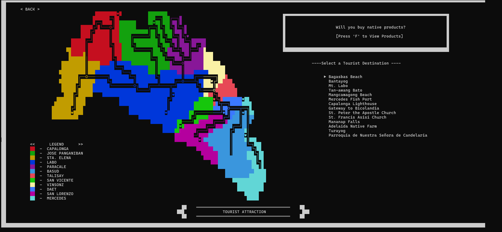

# N.O.R.T.E 🎯

A comprehensive Terminal/Console-based minigame designed for learning Data Structures and Algorithms through practical, hands-on gameplay.


---

## About the Project

**N.O.R.T.E** is an interactive educational minigame that helps beginners grasp complex Data Structures and Algorithms concepts through engaging challenges. Each game mode focuses on a specific DSA concept, making learning both fun and practical.
---

## Preview


*Choose from multiple DSA challenges*

---

## Key Features

### Multiple Learning Challenges

1. **Stack Challenge**: Learn LIFO operations
2. **Queue Challenge**: Master FIFO principles  
3. **Array Operations**: Practice sorting and searching
4. **Recursion Puzzles**: Grasp recursive thinking

---

##  Built With

- **Language**: Java
- **Concepts**: Data Structures & Algorithms
- **IDE**: IntelliJ IDEA
- **Game Logic**: Custom implementations

---

## Getting Started

### Prerequisites

- Java Development Kit (JDK) 8 or higher
- Terminal/Command Prompt
- Basic understanding of programming (helpful but not required!)

### Installation

1. **Clone the repository**
   ```bash
   git clone https://github.com/YOUR_USERNAME/NORTE.git
   ```

2. **Navigate to project directory**
   ```bash
   cd NORTE
   ```

3. **Compile the program**
   ```bash
   javac Main.java
   ```

4. **Run the game**
   ```bash
   java Main
   ```

---

## Future Enhancements

Planned features:

- [ ] Tree data structures (Binary Tree, BST)
- [ ] Graph algorithms (BFS, DFS)
- [ ] Hash table operations
- [ ] Advanced sorting algorithms (Quick Sort, Merge Sort)
- [ ] Multiplayer mode for competitive learning
- [ ] Achievement system
- [ ] Mobile app version
- [ ] Online leaderboards

---

## Academic Context

- **Course**: Data Structures and Algorithms
- **Institution**: Camarines Norte State College
- **Program**: BS Information Technology
- **Purpose**: Educational game for DSA learning
- **Academic Year**: 2024

---

## Known Issues

- None currently reported

Found a bug? Please [open an issue](https://github.com/YOUR_USERNAME/NORTE/issues).

---

## Contributing

This is an educational project, but contributions are welcome!

- **Bug Reports**: Found a problem? Let me know!
- **Feature Requests**: Have ideas for new challenges?
- **Improvements**: Code optimization suggestions welcome

---

## Author

**Emilyn B. Tagaan**

- **Program**: BS Information Technology  
- **Specialization**: Frontend UI Design
- **Passion**: Game Development & Educational Technology
- GitHub: [@YOUR_USERNAME](https://github.com/emilyntagaan)
- LinkedIn: [Emilyn Tagaan](https://www.linkedin.com/in/emilyn-tagaan-8138003b0/)
- Email: emilyntagaan18@gmail.com

---

## Acknowledgments

- DSA course professor for inspiration and guidance
- Classmates who beta-tested the game
- Online DSA learning communities for concept ideas
- Everyone who struggles with DSA - this is for you! 💪

---

## Recommended Resources

Want to learn more about DSA? Check these out:

- **Books**: "Introduction to Algorithms" by CLRS
- **Websites**: GeeksforGeeks, LeetCode, HackerRank
- **YouTube**: Abdul Bari DSA Playlist
- **Practice**: CodeSignal, Codewars

---

## License

This project is for educational purposes.

---

## Feedback

I'd love to hear your thoughts!

- **Email**: emilyntagaan18@gmail.com
- **LinkedIn**: [Emilyn Tagaan](https://www.linkedin.com/in/emilyn-tagaan-8138003b0/)
- **Issues**: [GitHub Issues](https://github.com/emilyntagaan/NORTE/issues)

---

## Show Your Support

If N.O.R.T.E helped you learn DSA concepts, please:

- Give the project a star ⭐
- Share it with classmates struggling with DSA
- Leave feedback to help improve the game

---

## Pro Tip

*"The best way to learn Data Structures and Algorithms is through practice. Don't just read about them - play with them!"*

---

**Making DSA Learning Fun! 🎮📚**

*Created with ❤️ for students by Emilyn B. Tagaan*
